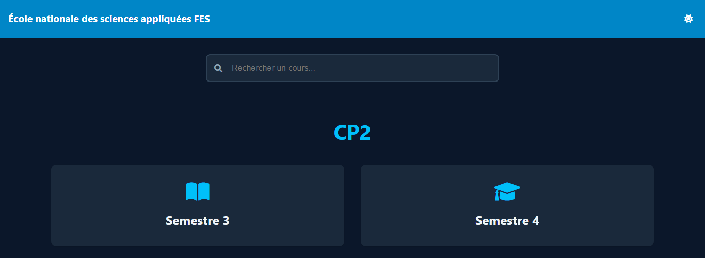

# 📚 Course Sharing Platform

A simple web-based platform that allows students to **browse and submit courses** for different semesters.  
The project is built using **HTML, CSS, and JavaScript** and is hosted on **GitHub Pages**.

---

## 🚀 Features
- 📂 **Browse Courses** by selecting a semester and course type (Cours, TD, TP).  
- ⬆️ **Submit Courses** with a name, description, and file upload option.  
- ❗ **Backend Limitation**: GitHub Pages does not support file uploads, so submitted courses do not get saved.  

---

## 🖼️ Screenshot  
  

---

## 🛠️ Technologies Used
- **HTML** for structure  
- **CSS** for styling  
- **JavaScript** for interactivity  

---

## ⚠️ Limitations
Since **GitHub Pages** is used for hosting, file uploads **do not work** as expected.  
For a fully functional version, a backend with **PHP, Node.js, or Python** is needed.

---

## 📌 Future Improvements
- ✅ **Database Integration** to store courses permanently.  
- ✅ **File Upload Support** using a backend service.  
- ✅ **User Authentication** for secure submissions.  

---

## 📂 Setup & Usage  
1. Clone the repository:  
   ```sh
   git clone https://github.com/B212M/CP2.git
